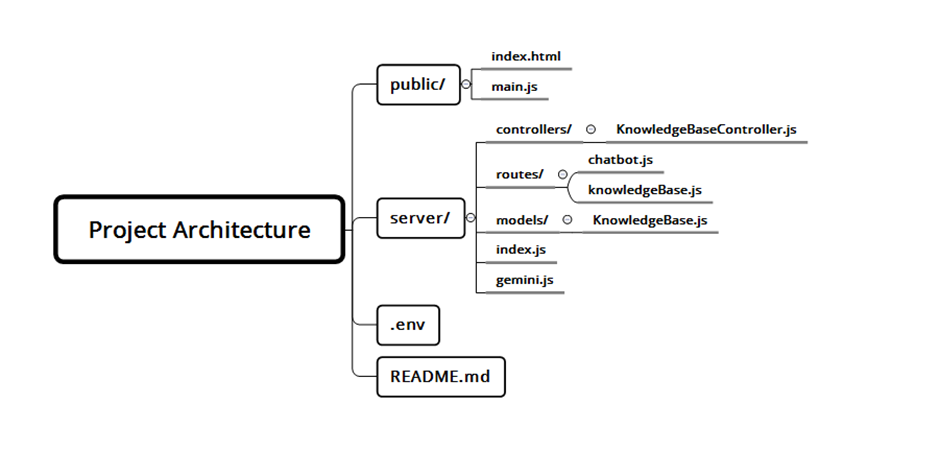

# ALX Assistance Chatbot

The **ALX Assistance Chatbot** is designed to assist software engineering students enrolled in the ALX Africa program. This chatbot enhances the student experience by providing quick and accurate responses to frequently asked questions. It leverages a combination of a knowledge base and the Gemini API for generating responses when the knowledge base does not contain the necessary information.


## Features

- Chatbot Interface:

    A simple and user-friendly interface for students 
    to ask questions.

- Knowledge Base:
    
    Stores frequently asked questions and their 
    corresponding answers.

- Dynamic Responses:
    
    Generates responses using the Gemini API for    
    questions not covered in the knowledge base.
    
## Technologies

- **Frontend:** HTML, TailwindCSS, JavaScript.

- **Backend:** Node.js, Express.js, MongoDB, Mongoose.

- **API Integration:** Gemini API (Google Generative AI).
## Project Architecture




**1. Public/**

    /index.html:
    The front-end of the application containing the 
    HTML structure for the chatbot interface, styled
    using TailwindCSS.
    
    /main.js:
    Handles user input and interaction with
    the chatbot. It sends the user's messages to the 
    back-end and displays the chatbot's responses.
**2. Server/**

    This folder contains all the back-end logic and    
    server configuration.

    Controllers/

    /KnowledgeBaseController.js:
    Handles user queries by first checking the  
    knowledge base for predefined answers. If no match
    is found, it sends the query to the Gemini API fo
    a response.

    Models/

    KnowledgeBase.js: 
    Mongoose model defining the schema for the
    knowledge base, where question-and-answer pairs 
    are stored in MongoDB.

    Routes/

    /chatbot.js:
    Handles incoming chatbot queries and links to the 
    handleQuery function in KnowledgeBaseController.js.

    /knowledgeBase.js:
    Manages user queries to the knowledge base, also  
    linking to the handleQuery function in 
    KnowledgeBaseController.js.

    /gemini.js:
    Integrates the Google Gemini API. It uses the API 
    key from the .env file and provides a model to 
    generate content when a suitable answer is not 
    found in the knowledge base.

    index.js:
    The main server file that configures and starts    
    the Express server. It sets up middleware, 
    connects to the MongoDB database, and includes 
    routing for the chatbot and knowledge base APIs.

**3. /.env**

    This file stores environment variables, such as    
    the API key for the Gemini API and the MongoDB 
    connection string.

**4. /README.md**

    Contains setup instructions, usage guidelines, and 
    an overview of the project architecture.
## Installation

Install my-project with npm

```bash
  npm install my-project
  cd my-project
```
1. Clone the repository
```bash
  git clone https://github.com/nadertoti/
  alx-chatbot-assistance.git

  cd alx-assistance-chatbot
```
2. Install dependencies
```bash
    npm install
```
3. Install MongoDB
```bash
    If MongoDB is not installed on your machine,  
    follow these steps to install and start MongoDB:

    Step 1: Update the package list:

    sudo apt update
    
    Step 2: Install MongoDB:

    sudo apt install mongodb

    Step 3: Start the MongoDB service:

    sudo service mongodb start

    Step 4: Access the MongoDB shell:
    
    mongo
```

4. Set up the knowledge base in MongoDB
```bash
    Step 1: Switch to the chatbot database:

    use chatbot;

    Step 2: Insert initial data into the 
    knowledgebases collection:

    db.knowledgebases.insertMany([
        { question: 'What is the registration 
        deadline? ', response: 'The registration    
        deadline is August 31st.' },
        { question: 'How can I reset my password?', 
        response: 'You can reset your password by 
        clicking on "Forgot Password" on the login 
        page.' }]);

    Step 3: Confirm the data has been inserted by   
    viewing the collections:

    show collections;
    db.knowledgebases.find().pretty();
```

5. Set up environment variables
```bash

    Create a .env file in the root directory.
    Add your MongoDB connection string and Gemini API  
    key:
    MONGODB_URI=your_mongodb_connection_string
    GEMINI_API_KEY=your_gemini_api_key
    PORT=3000
```

6. Run the server
```bash
    node server/index.js
```

7. Access the application
```bash

    Open your browser and go to http://localhost:3000.
```

## Usage Guidelines

1. Interacting with the Chatbot:
```bash

1.Type your question in the input box and press Enter.

2.If the chatbot recognizes your question, it will provide a predefined response from the knowledge base.

3.If not, the chatbot will generate a response using the 
Gemini API.
```
2. Admin Panel (Future Feature):
```bash
Once implemented, admins will be able to manage the knowledge base directly from a web interface.
```
## Future Enhancements
```bash
1. Admin Panel: A secure interface for adding, editing, and deleting knowledge base entries.

2. User Authentication: Implement user authentication to protect the admin panel.

3. Chatbot Training: Enhance the chatbot's ability to learn from user queries and improve response accuracy over time.
```
## Contributing

Contributions are always welcome!

See `README.md` for ways to get started.

Please adhere to this project's `code of conduct`.


## License

- This project is licensed under the MIT License - see the [License](https://choosealicense.com/licenses/mit/) file for details.


## Authors

- [@nadertoti](https://www.github.com/nadertoti)

